# go-web-demo: golang + gin
这是一个基于[golang](https://golang.org/) + [gin](https://gin-gonic.com/)的基础Web框架。项目是完全按照Gopher
公认的[项目标准结构](https://github.com/golang-standards/project-layout)定制，很多组件的实现大量参考[B站](https://www.bilibili.com)
开源的[Kratos](https://github.com/bilibili/kratos)设计理念。为加深自己对go的理解，写了一些Web常用的Examples。

包含如下特性：
* 基于[gin](https://gin-gonic.com/)的轻量级web框架，拥有更加出色的性能。
    * gin-validator表单验证。底层实现:https://gopkg.in/go-playground/validator.v8
    * middleware拦截功能：可以自由的实现一些拦截handler
    * swagger API文档
    * pprof：性能分析工具
    * 优雅退出机制

* 基于[toml](https://github.com/toml-lang/toml)的配置文件，真的是谁用谁知道。
* 参考[Kratos](https://github.com/bilibili/kratos)实现的log组件。支持配置日志位置、按文件大小滚动日志、缓冲大小等。   
* 参考[Kratos](https://github.com/bilibili/kratos)实现的mysql组件。读写分离、支持事务、慢查询日志记录等。
* 基于[redigo](https://github.com/gomodule/redigo)封装的redis组件。这也是golang官方推荐的redis包。
* 基于net/http封装的http连接池组件。
* 经典的错误码设计理念，与golang的error处理机制完美结合。
* and so on...

# 项目结构
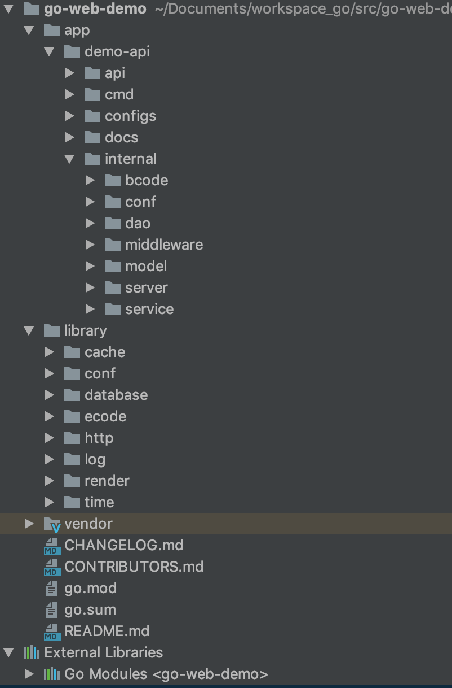

# 更新 2020-04-17
* 新加基于 [hystrix-go](https://github.com/afex/hystrix-go) 的熔断器。
* 优化 http Client 组件，并集成 hystrix，配置 demo 如下
```toml
[httpClient]
    [httpClient.abc]
        addr = "http://api.abc.com"
        [httpClient.abc.clientConf]
            maxTotal = 10
            maxPerHost  = 10
            keepAlive = "5s"
            dialTimeout = "1s"
            timeout = "1s"
            [httpClient.abc.clientConf.breaker]
                namespace = "abc"
                timeout = "3s"
                maxConcurrentRequests = 5
                requestVolumeThreshold= 1
                sleepWindow = "5s"
                errorPercentThreshold = 50
```
* 新加 gRPC Client 组件，并集成 hystrix，配置 demo 如下
```toml
[grpcClient]
    [grpcClient.sayHello]
        addr = "10.1.172.180:9101"
        [grpcClient.sayHello.clientConf]
            dialTimeout = "1s"
            timeout = "1s"
            poolSize = 4
            [grpcClient.sayHello.clientConf.breaker]
                namespace = "sayHello"
                timeout = "1s"
                maxConcurrentRequests = 1000
                requestVolumeThreshold= 10
                sleepWindow = "5s"
                errorPercentThreshold = 60
```
* 完善相关组件单元测试

# 使用说明

## 安装编译
```$xslt 
$ go get github.com/daoshenzzg/go-web-demo

# go get代理，org包要科学上网
$ export GOPROXY=https://goproxy.io

# 开启GO111MODULE模式
$ export GO111MODULE=on

# 使用GO MODULE模式管理包
$ go mod init

# 编译
$ cd ../app/demo-api/cmd; go build

# 运行
$ ./cmd -conf ../configs/application.toml 
或者指定端口
$ ./cmd -conf ../configs/application.toml --http.port=8080
```

## Swagger

### 安装swagger
1、go get
```$xslt
$ go get -u github.com/swaggo/swag/cmd/swag
```
若 $GOPATH/bin 没有加入$PATH中，你需要执行将其可执行文件移动到$GOBIN下
```$xslt
$ mv $GOPATH/bin/swag /usr/local/go/bin
```
2、gopm get
```$xslt
gopm get -g -v github.com/swaggo/swag/cmd/swag

cd $GOPATH/src/github.com/swaggo/swag/cmd/swag

go install
```
同理将其可执行文件移动到$GOBIN下

### 验证是否安装成功
```$xslt
$ swag -v
swag version v1.5.0
```

### 编写API注释
```$xslt
// @Summary 添加学生
// @Produce json
// @Param studName query string true "学生姓名"
// @Param studAge query int true "年龄"
// @Param studSex query string true "性别"
// @Success 200 {object} render.JSON
// @Router /api/v1/student/add [post]
```

### 生成
我们进入到demo-api的根目录，执行初始化命令
```$xslt
$ cd ../app/demo-api
$ swag init
  2019/07/12 18:33:53 Generate swagger docs....
  2019/07/12 18:33:53 Generate general API Info
  2019/07/12 18:33:59 Generating render.JSON
  2019/07/12 18:33:59 create docs.go at  docs/docs.go
  2019/07/12 18:33:59 create swagger.json at  docs/swagger.json
  2019/07/12 18:33:59 create swagger.yaml at  docs/swagger.yaml
```

### 验证
大功告成，访问：http://localhost:8080/swagger/index.html

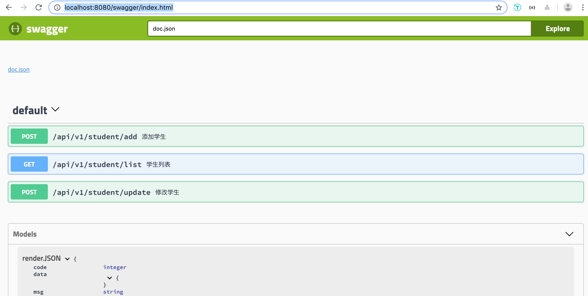

## pprof性能分析工具

### 安装pprof
请参考：https://github.com/DeanThompson/ginpprof

### 验证
大功告成，访问：http://localhost:8080/debug/pprof/
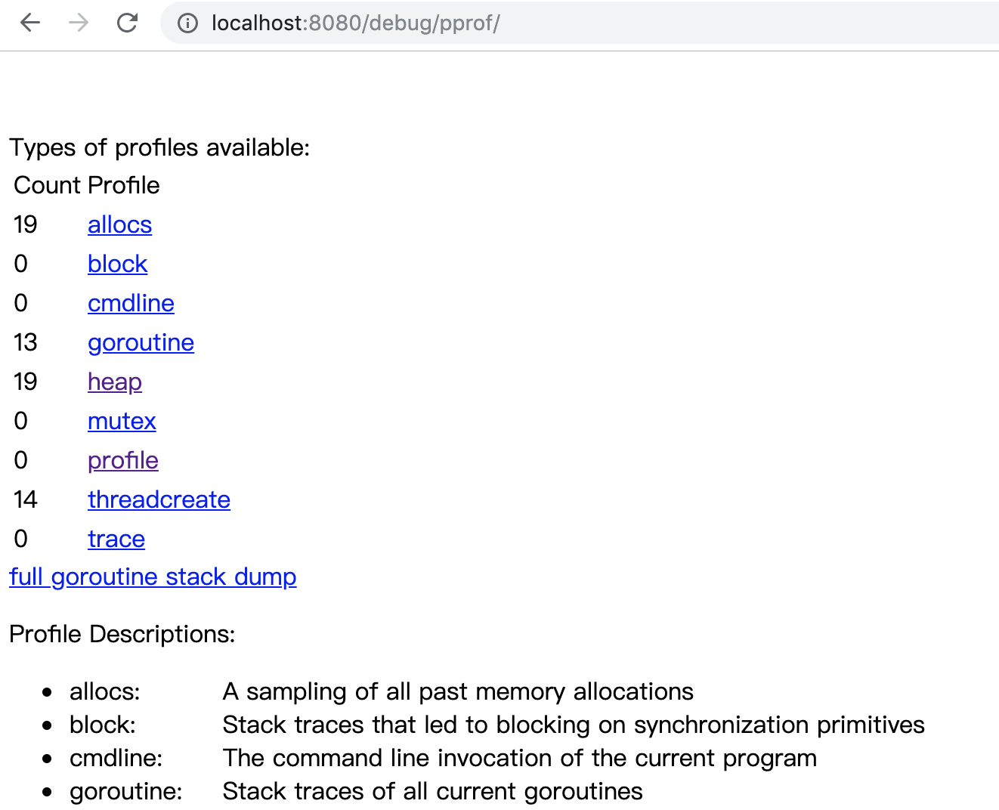

### pprof实战
请参考：https://blog.wolfogre.com/posts/go-ppof-practice/

## 代码片段

### 基于toml的配置文件
用起来不要太爽，谁用谁知道...

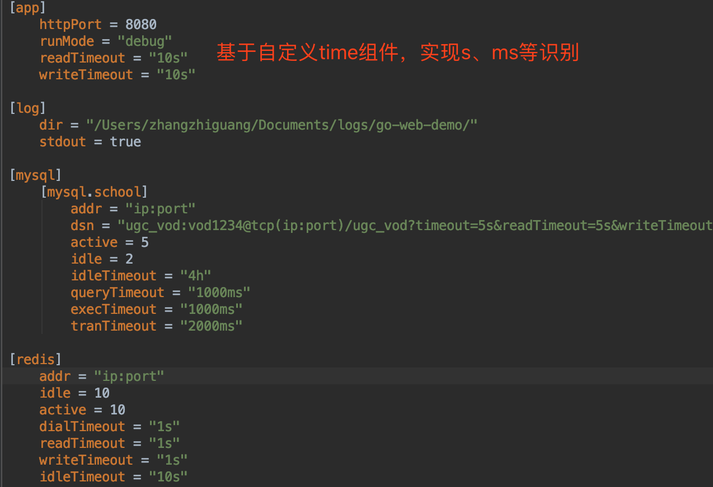

### Router配置
基于gin的Router高效、强大、简单

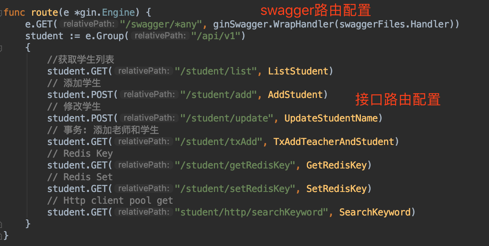

### Middleware拦截器
基于gin的middleware，可以实现日志打印、权限验证等等..

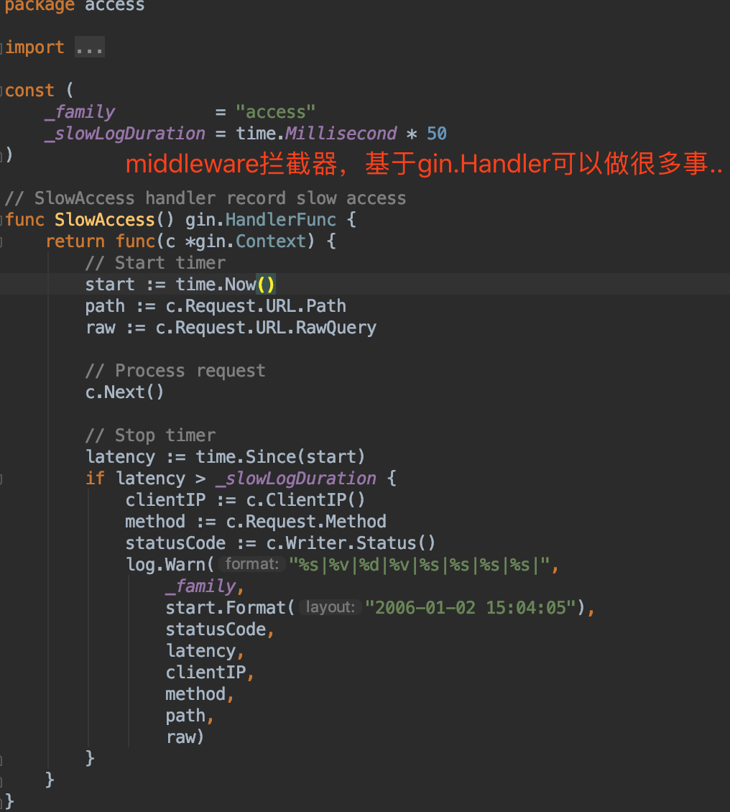

### 表单Validator功能
很实用的表单validation功能，文档：https://gopkg.in/go-playground/validator.v8

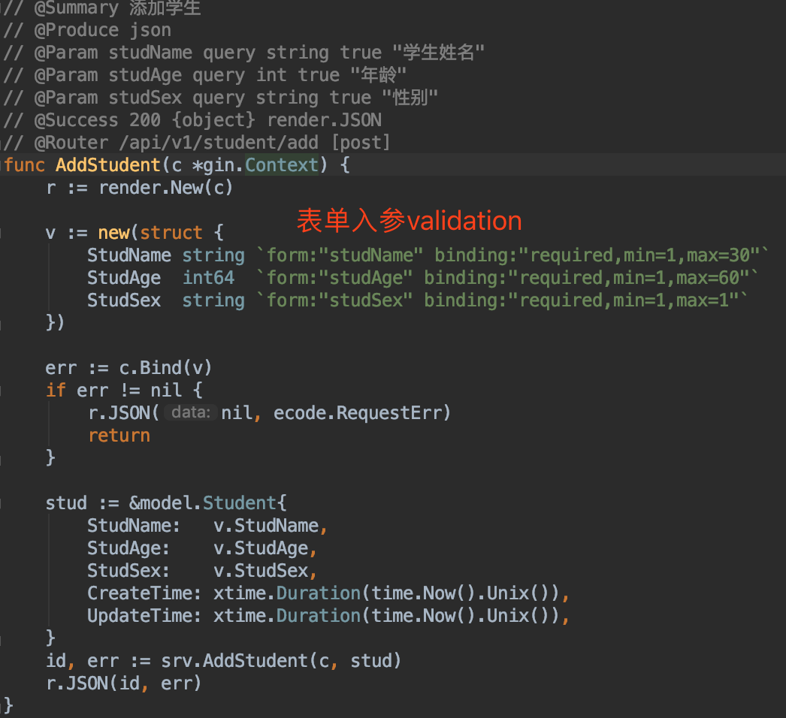

### 优雅退出
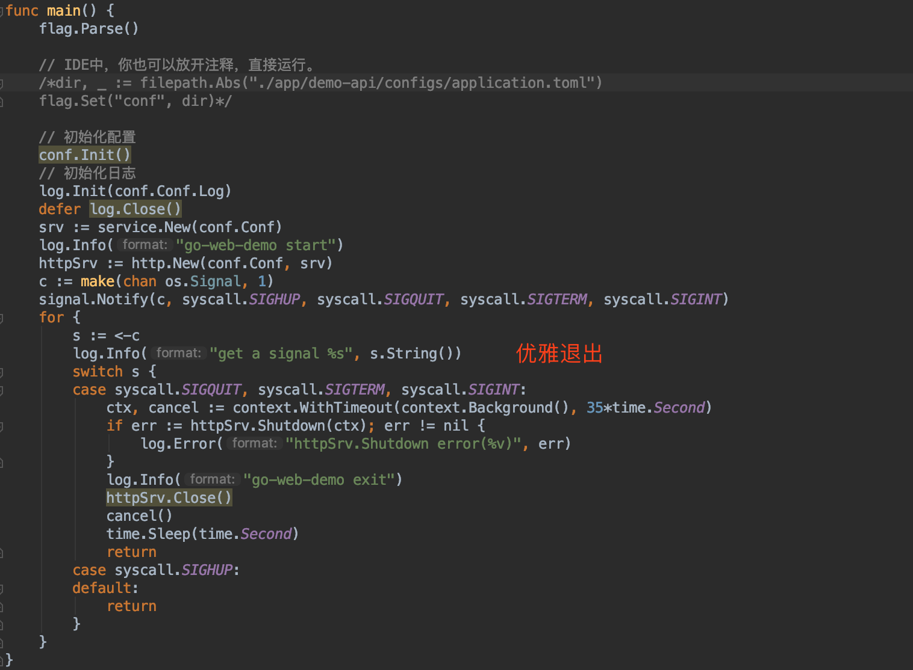

### 经典优雅的错误码设计
定义Codes，并直接errors.Cause(e).(Codes)进行强转判断，完美兼容golang的error显性处理机制

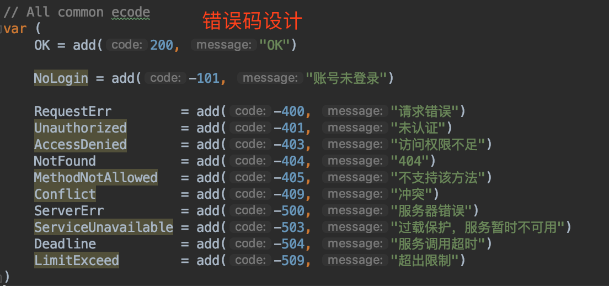

### DB事务操作
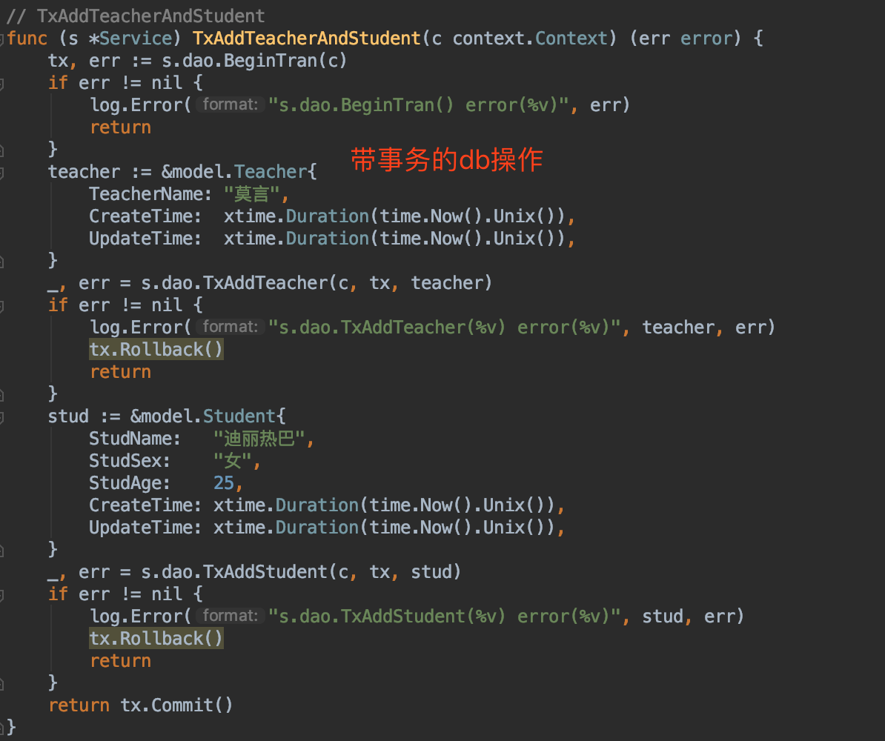

### Redis操作
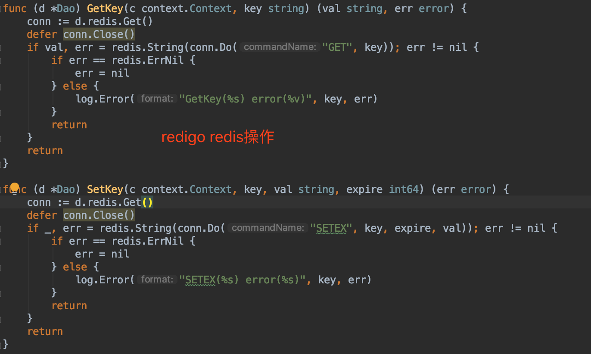

### Http连接池请求连接复用
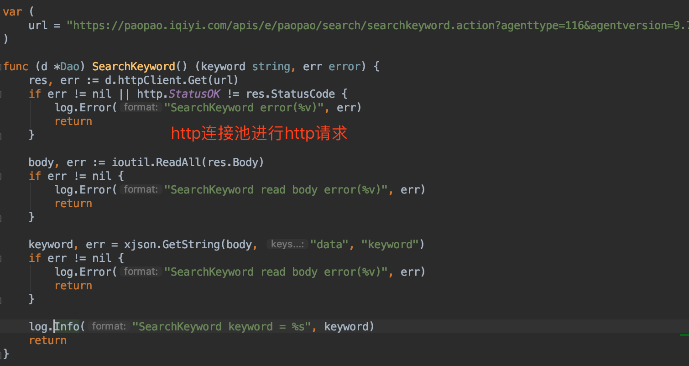

# 后续规划
* [x] DB、Redis、Http、gRPC组件
* [x] 熔断器
* [ ] Router限速器功能

# 参考项目
* https://github.com/gin-gonic/gin
* https://github.com/EDDYCJY/go-gin-example
* https://github.com/bilibili/kratos
